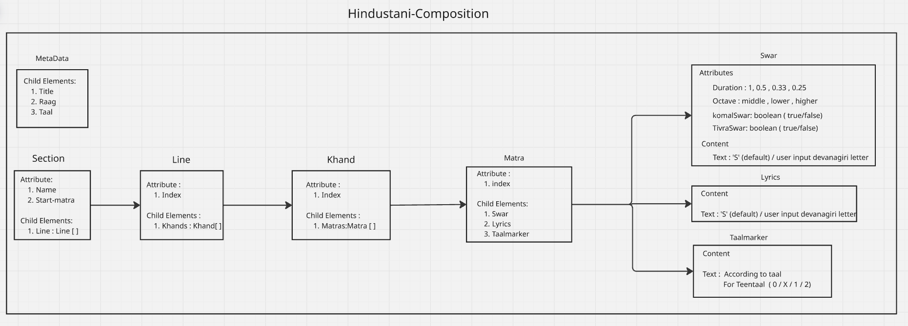

# Swartaal - Hindustani Classical Music Notation

Generate Hindustani classical music notation in XML format.

## Installation
```bash
npm install swartaal
```

## Project Structure

The library is organized around the following hierarchical model of Hindustani classical music composition:



### Hierarchy Breakdown

```
Hindustani-Composition
│
├── MetaData
│   ├── Title
│   ├── Raag
│   └── Taal
│
└── Section (स्थायी / अंतरा)
    ├── Attribute: Name
    ├── Attribute: Start-matra
    └── Child Elements: Line[]
        │
        └── Line
            ├── Attribute: Index
            └── Child Elements: Khand[]
                │
                └── Khand
                    ├── Attribute: Index
                    └── Child Elements: Matra[]
                        │
                        └── Matra
                            ├── Attribute: index
                            └── Child Elements:
                                ├── Swar (attributes: duration, octave, komal, tivra)
                                ├── Lyric (text content)
                                └── Taalmarker (text content)
```

### Core Components

- **MetaData**: Title, Raag, and Taal information
- **Section**: Major sections like स्थायी (Sthayi) and अंतरा (Antara)
- **Line**: Individual melodic lines within a section
- **Khand**: Segments of the Taal (rhythm cycle)
- **Matra**: Individual beat units containing Swar (note) and Lyric (text)
- **Swar**: Musical note with duration and octave information
- **Lyric**: Associated text/syllable
- **Taalmarker**: Rhythm cycle markers (Sam, Khali, etc.)

## Usage

```typescript
import { Swar, Lyric, Matra, Khand, Taal } from 'swartaal';

// Create a Swar (note)
const swar = new Swar('सा', 1, { octave: 'middle' });

// Create a Lyric
const lyric = new Lyric('सा');

// Create a Matra (beat)
const matra = new Matra('9', '0', swar, lyric);

// Create a Khand (segment)
const khand = new Khand('3', [matra]);

// Create a Taal (rhythm cycle)
const taal = new Taal('teentaal');

// Generate XML
console.log(matra.toXML());
console.log(khand.toXML());
console.log(taal.toXML());
```

## API Documentation

### Swar Class
```typescript
new Swar(text: string, duration: number, options: SwarOptions): Swar
```

### Lyric Class
```typescript
new Lyric(text: string): Lyric
```

### Matra Class
```typescript
new Matra(index: string, taalmarker: string, swar: Swar, lyric: Lyric): Matra
```

### Khand Class
```typescript
new Khand(index: string, matras: Matra[]): Khand
addMatra(matra: Matra): void
getMatras(): Matra[]
```

### Taal Class
```typescript
new Taal(taalType: TaalTypes): Taal
getTaalName(): TaalTypes
getTotalMatras(): number
getKhands(): number
getKhandMatras(): number[]
```

## License

MIT
